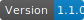

# Repository badges generator
For a SVG repository badges.
Module installs the following binary commands:
> `coverage-badges` - Jest test coverage badges from `coverage-summary.json` (options: **--read**, **--save**)

> `custom-badges` - Fully configurable badges from `badges.json` (options: **--read**, **--save**)

> `version-badge` - Package version badge from `package.json` (options: **--save**)

## Installation:

> `yarn add @adso-ts/badges`

## Dependencies
### For `coverage-badges`
Jest coverage report must be saved as `coverage-summary.json`, thus requires the following entries in `jest.config.js` are necessary:

```javascript
module.exports = {
  ...
    collectCoverage: true,
    coverageReporters: ['json-summary'],
  ...
};
```

### For `custom-badges`
A config file must be present and pointed to when executing `custom-badges` command.
```json
{
  "badges": [
    {
      "badge_name": {
        "label": "Badge label",
        "value": "value to show",
        "color": "hexadecimal color for value background"
      }
    }
  ]
}
```

## Generate badges:
#### yarn script in package.json
```javascript
"scripts": {
    "coverage-badges": "coverage-badges --read=custom_path_to_coverage-summary.json --save=custom_badges_folder"
    "custom-badges": "custom-badges --read=custom_path_to_badges.json --save=custom_badges_folder"
    "version-badge": "version-badge --save=custom_badges_folder"
}
```

#### Console commands
```javascript
  yarn coverage-badges
  yarn custom-badges
  yarn version-badge
```

## Parameters (optional)
- `read` : alternative location of `JSON` file (`coverage-summary.json` or `badges.json`)
- `save` : custom path to save badge svg files

#### shell
`node node_modules/@adso-ts/badges`

or
> yarn coverage-badges

> yarn custom-badges

> yarn version-badge

## Usage in markdown files
### Jest test coverage

```md
   
 
 
 
 
 
```

 ### Package version

```md
  
```

 ### Custom/static badges examples
```md
 
 
```


#### Results
##### Test coverage
 
 
 
 
 
 

##### Version
 

##### Custom/static badges examples
 
 
