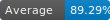

# Jest coverage badges generator

## Installation:

> `yarn add @adso-ts/badges`

## Generate badges:
#### yarn script
```
"scripts": {
    "badges": "coverage-badges --read=custom path to coverage-summary.json --save=custom badges folder"
}
```
And in the console
```
yarn badges
or
yarn coverage-badges
```
## Parameters (optional)
- `read` : alternative location of `Jest` coverage summary file (`coverage-summary.json`)
- `save` : custom save badge svg files

#### shell
`node node_modules/@adso-ts/badges`
or
`yarn coverage-badges`

## Usage in markdown files

```md
   
 
 
 
 
 
 ```

#### Results

   
 
 
 
 
 

## TODO list
- extend to create repository status badges